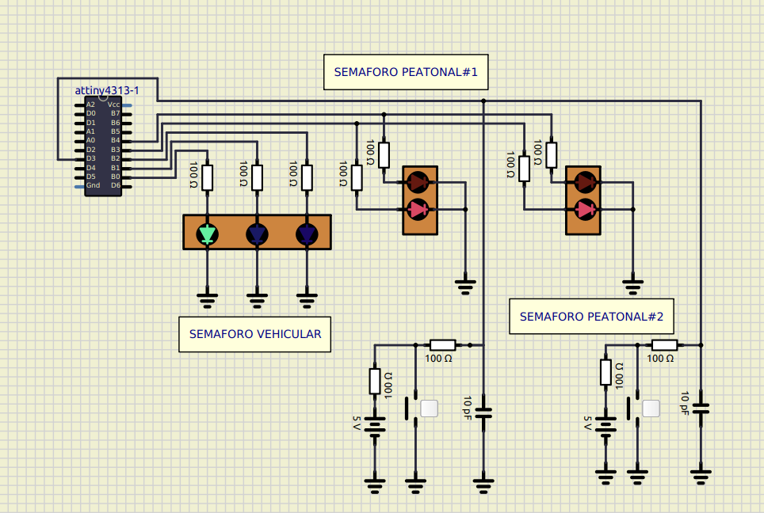
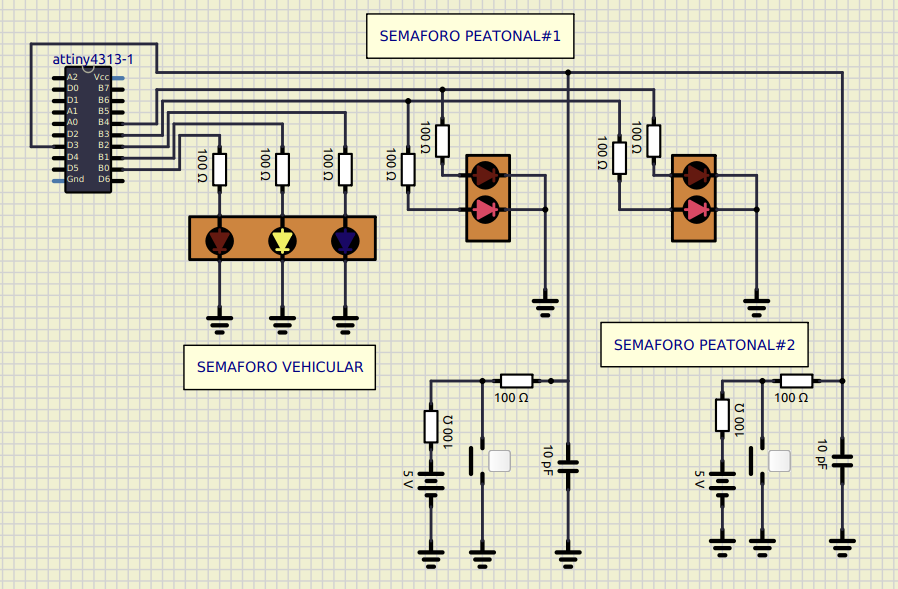
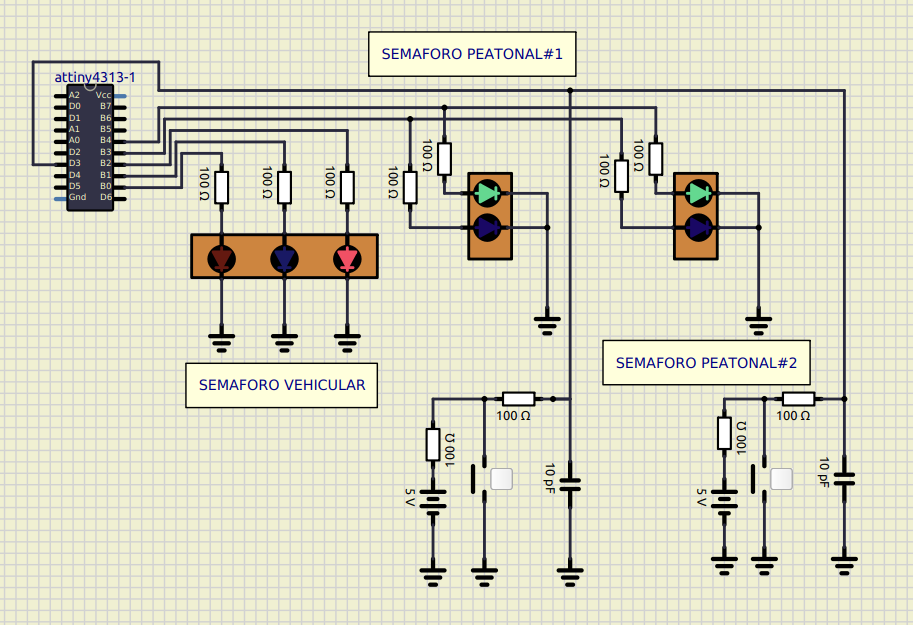
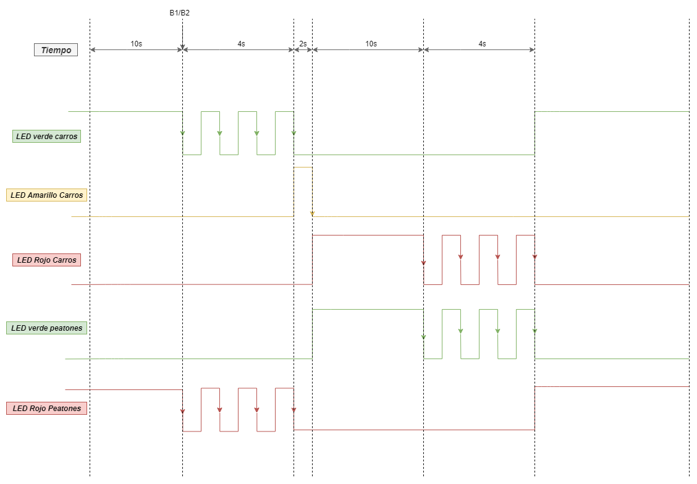

Laboratorio de Microcontroladores IE - 0624

Laboratorio#2

GPIOs, Timers y FSM

Gabriel Fernando Araya Mora B80525

-----
Para este laboratorio se pide el diseño de un semaforo digital utilizando el mcu Attiny4313. Para ejecutar el laboratorio, se utiliza una maquina de estados (FSM) con 5 estados, además se hace uso de las interrupciones y timers disponibles en el MCU. 

Maquina de estados:

Carros avanzando (CA):
El estado CA, será el estado por defecto de la máquina, ya que los carros deben poder avanzar siempre a menos que haya un peaton esperando paso. Lo anterior se traduce a que la luz verde para los carros debe estar encendida indefinidamente, mientras que la luz roja para los peatones debe estar encendida indefinidamente. 

-----

Stop Carros (SC):
El estado SC se encarga de prender la luz amarrila para los vehiculos, dejando la luz roja para los peatones.

-----

Peatones avanzando(PA):
Se tiene un estado inverso al de los carros avanzando en el cual, el semáforo estará rojo para los carros impidiendo su paso, pero verde para los peatones permitiendo su paso.

-----

Estados de parpadeo (BRV/BVR):

Los estados de parpadeo son 2, uno para el parpadeo de las luces verde y roja para el estado de Carros avanzando, y el otro es el estado inverso para hacer parpadear las luces verde y roja del estado de peatones avanzando. 

-----
Diagrama de temporización:

El diagrama de temporización dado por el profesor se cambió con el fin de acomodar el led amarillo en la temporización, sin embargo el sistema funciona exactamente igual, solo que tarda dos segundos más. 

