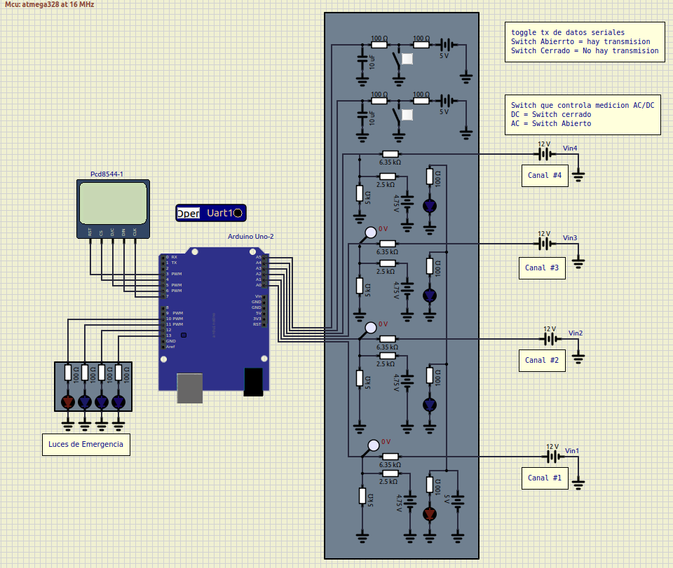
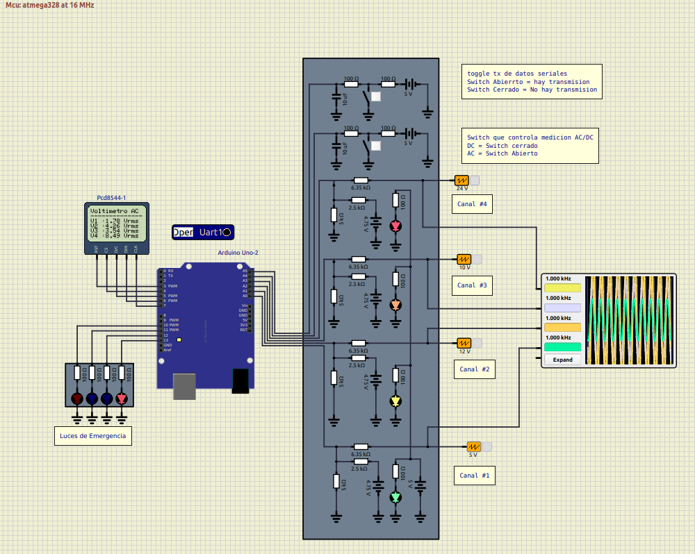
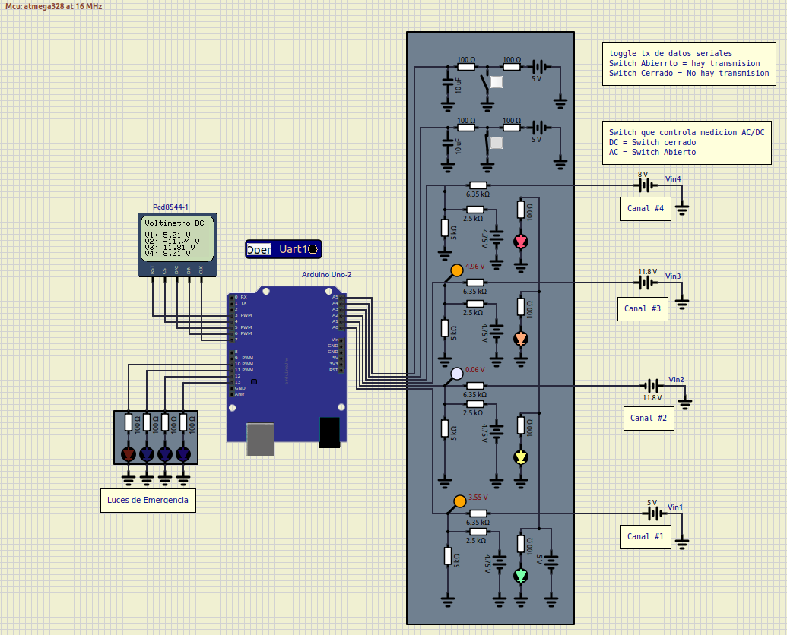
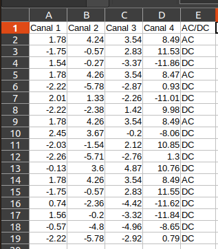

Laboratorio de Microcontroladores IE - 0624

Laboratorio#3

Arduino: GPIO,ADC y comunicaciones

Gabriel Fernando Araya Mora B80525

----

Primero se muestra el diseño total del voltímetro a implementar, con sus luces de emergencia, pantalla, puertos de lectura y el microcontrolador en cuestión.

El diseño cuenta con dos switches encargados, uno de cambiar el modo de lectura ya sea AC o DC, normalmente se encuentra leyendo tensiones alternas, al cerrar el switch pasa a medir DC. 

El segundo switch se encarga de abrir o cerrar el flujo de datos por el puerto serial, con el switch abierto se tiene flujo de datos, con el switch cerrado se para el flujo de datos. 

----

Ejemplo de medición AC:

----

Ejemplo de medición DC:

----

Por último se muestra el CSV generado por el script de python:

